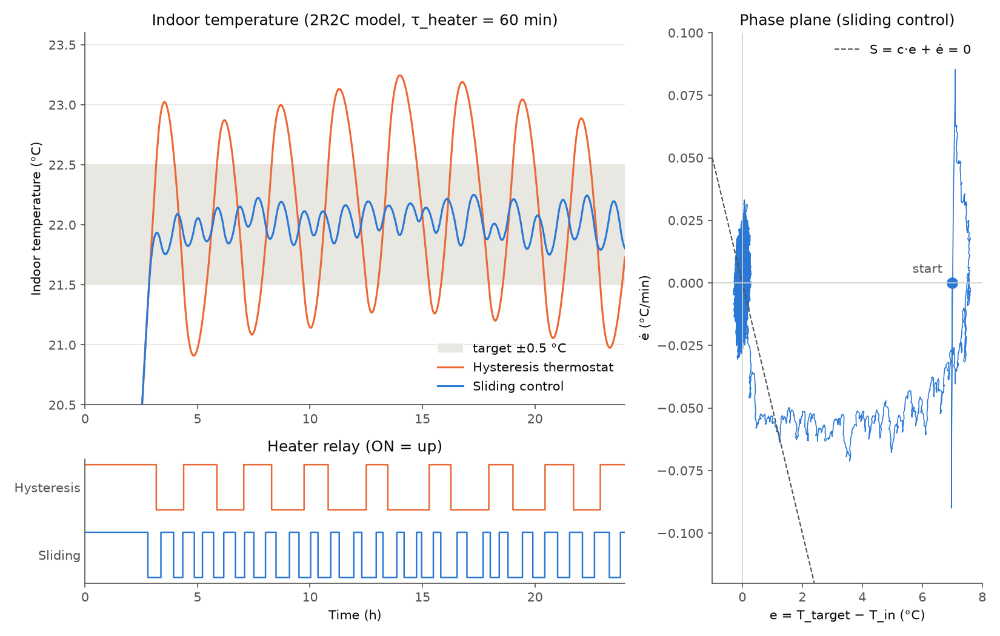

# smart_hvac_controller

시계열 데이터 기반 기숙사/연구실 스마트 냉난방 제어기.

공간과 난방기의 열용량 때문에 생기는 **열적 지연(time lag)과 오버슈팅**을 줄이기 위해, 실내 온도 시계열과 기상청 외기 예보를 결합해 냉난방기를 **미리** 켜고 끄는 예측형 스마트 서모스탯입니다.

## 시뮬레이션 결과



2R2C 모델(아래 2장)로 하루(24시간) 동안 일반 서모스탯과 슬라이딩 제어를 비교했습니다.
환절기 외기(평균 8℃, 일교차 ±4℃), 히터 시상수 τ_h = 60분, 목표 22℃, 센서 0.1℃ 양자화+잡음을 넣었습니다.

| 제어기 | 최대 오버슈팅 | 에너지 | 쾌적도 이탈 (밴드 밖 ℃·min) | 릴레이 전환 횟수 |
| --- | --- | --- | --- | --- |
| 히스테리시스 (±0.5℃) | 1.25℃ | 18.48 kWh | 277.3 | 16 |
| 슬라이딩 (S = c·e + ė) | **0.25℃** | **18.06 kWh (−2.3%)** | **0.0** | 44 |

- 슬라이딩 제어는 오버슈팅을 1/5로 줄이고 온도를 목표 밴드 안에 유지합니다.
- 대신 릴레이 전환 횟수가 약 3배로 늘어납니다. 5분 락아웃이 있어도 릴레이 수명 측면에서는 비용입니다.
- 기획 단계에서 가정한 **2~3℃ 오버슈팅은 이 모델에서 재현되지 않았습니다.** 오버슈팅은 외기가 따뜻할수록(난방 여유 출력이 클수록), 히터 열용량이 클수록 커집니다:

| 외기 평균 | τ_h = 15분 | τ_h = 60분 |
| --- | --- | --- |
| 0℃ | 0.71 → 0.12℃ | 0.83 → 0.21℃ |
| 8℃ | 0.96 → 0.28℃ | 1.25 → 0.25℃ |
| 14℃ | 1.29 → 0.44℃ | 1.67 → 0.48℃ |

(히스테리시스 → 슬라이딩)

### 실행 방법

```bash
g++ -std=c++17 -O2 sim.cpp -o sim && ./sim     # 결과 표 출력 + results.csv 생성
python3 -m venv .venv && .venv/bin/pip install -r requirements.txt
.venv/bin/python plot.py                       # result.png 생성
```

제어 로직을 C++로 작성한 이유: ESP32/아두이노 펌웨어도 C++이므로, 시뮬레이터에서 검증한 제어 코드를 보드로 그대로 옮길 수 있습니다.

---

## 1. 문제 정의

일반 온·오프 서모스탯(히스테리시스 제어)의 한계:

- **오버슈팅**: 히터를 꺼도 라디에이터·바닥에 남은 열 때문에 설정 온도보다 2~3℃ 과열
- **외란 오판**: 문 열림·환기로 인한 일시적 온도 급락을 장기 냉각으로 오인해 과도하게 난방
- **외기 무시**: 기온이 떨어질 것을 미리 알아도 반영하지 못함

## 2. 물리 모델

### 왜 1차 RC 모델로는 부족한가

$$C\,\frac{dT_{in}}{dt} = \frac{T_{out}-T_{in}}{R} + P\,u$$

이 모델에서는 히터를 끄는 순간(u=0) 곧바로 dT/dt < 0이 되므로 **오버슈팅이 원리상 생기지 않습니다.**
실제 오버슈팅은 난방기 자체의 열용량과 센서 지연에서 옵니다.

### 2R2C 모델 (히터 노드 + 실내 노드)

$$C_h\,\dot T_h = P\,u - \frac{T_h - T_{in}}{R_h}$$

$$C_r\,\dot T_{in} = \frac{T_h - T_{in}}{R_h} - \frac{T_{in}-T_{out}}{R_o} + Q_{dist}$$

| 기호                   | 의미                                        |
| ---------------------- | ------------------------------------------- |
| $T_h, T_{in}, T_{out}$ | 히터(라디에이터) 온도, 실내 온도, 외기 온도 |
| $C_h, C_r$             | 히터 열용량, 실내(공기+벽체) 열용량         |
| $R_h, R_o$             | 히터→실내 열저항, 실내→외기 열저항          |
| $P, u$                 | 히터 출력, 릴레이 상태(0/1)                 |
| $Q_{dist}$             | 외란(문 열림, 재실자, 일사 등)              |

꺼진 뒤 올라가는 온도의 상한은 대략

$$\Delta T_{over} \approx \frac{C_h\,(T_h - T_{in})}{C_r}$$

입니다. 대안으로 1차+데드타임(FOPDT) 모델을 써도 됩니다.

### 파라미터 추정: 온라인 RLS

- 망각계수 λ ≈ 0.98~0.995의 재귀 최소제곱(RLS)으로 $R_h, C_h, R_o, C_r$(또는 FOPDT의 시상수·데드타임 L)를 계속 갱신
- 파라미터는 양수로 제약
- **외란 구간에서는 갱신 정지**: (온도 기울기 < 임계값) 그리고 (습도 급변)이면 문 열림으로 판단

## 3. 제어 알고리즘

최종 제어 입력 = **피드포워드(외기) + 슬라이딩 피드백(오차)**

### 3.1 피드포워드: 외기 보상

정상상태에서 필요한 듀티비:

$$u_{ff} = \frac{T_{target} - T_{out}}{R_o\,P}$$

기상청 단기예보로 1~3시간 뒤 외기 하락이 예상되면 미리 예열합니다.

### 3.2 피드백: 위상 평면 슬라이딩 제어

- 상태 변수: $e = T_{target} - T_{in}$, $\dot e = -\dfrac{dT_{in}}{dt}$
- 슬라이딩 서피스:

$$S = c\,e + \dot e = c\left(e + \tfrac{1}{c}\dot e\right) \approx c\cdot e\!\left(t+\tfrac{1}{c}\right)$$

즉 **S > 0은 "1/c 뒤의 예측 오차가 양수"** 라는 뜻이며, 선형 외삽 예측과 같은 식입니다.

- 예측 지평 $1/c \approx L + \tau_h$ ($\tau_h = R_h C_h$: 히터 시상수, L: 데드타임+필터 지연)
  - 방 전체 시상수 $\tau = R_o C_r$(수 시간)가 **아님**에 주의
- 스위칭 규칙: S > +δ → ON, S < −δ → OFF, 그 사이는 현재 상태 유지
- 최소 유지 시간 5분 락아웃(채터링 방지, 에어컨 컴프레서 보호)

### 3.3 최적제어 관점 (폰트랴긴 최소 원리)

- 비용 함수: $J=\int (q\,e^2 + r\,u)\,dt$, $u\in\{0,1\}$
- 해밀토니안: $H = q\,e^2 + r\,u + \lambda^\top f(x,u)$
- 최적 해는 스위칭 함수 $\sigma = r + \lambda^\top B$의 부호에 따른 **뱅뱅 제어**
- 2R2C 모델에서 최적 스위칭 곡선은 "u=0 상태로 원점에 도달하는 궤적"이며, 직선 S는 이 곡선의 선형 근사입니다.

> 용어: 여기서의 해밀토니안은 해석역학이 아니라 **최적제어(PMP)** 의 해밀토니안입니다.

## 4. 신호 처리

| 항목      | 방법                                      | 이유                                                                                        |
| --------- | ----------------------------------------- | ------------------------------------------------------------------------------------------- |
| 샘플링    | 10초                                      |                                                                                             |
| 평활화    | 1차 EMA                                   | 지연 ≈ (1−α)/α 샘플이므로 L에 포함해 설계                                                   |
| 기울기 ė  | 5~10분 창 최소제곱 기울기(Savitzky–Golay) | DHT22 분해능 0.1℃ → 10초 차분 시 양자화 잡음 ±0.6℃/min로, 실제 기울기(0.05~0.2℃/min)보다 큼 |
| 외란 감지 | 기울기 + 습도 급변                        | 감지 구간은 제어·RLS 갱신 정지                                                              |

## 5. 시스템 구성

> 아래는 목표 구성입니다. 현재 구현된 것은 `sim.cpp`(시뮬레이터)와 `plot.py`(그래프)뿐입니다.

```
[ESP32 + SHT31/DHT22] --WiFi(MQTT/HTTP)--> [PC: Python]
                                              ├─ collector   : 10초 수집 → SQLite
                                              ├─ kma_client  : 기상청 초단기실황/단기예보 T_out (1시간마다)
                                              ├─ estimator   : 2R2C/FOPDT RLS (외란 구간 freeze)
                                              ├─ controller  : u_ff + 슬라이딩(S=c·e+ė, ±δ, 5분 락아웃)
                                              ├─ actuator    : 스마트플러그 API / IR 블래스터
                                              └─ dashboard   : Streamlit
[simulator: 2R2C 모델 + 문 열림 외란] ── 센서/액추에이터 자리에 그대로 교체 가능
```

### 기술 스택

Python, SQLite, Streamlit, 기상청 공공데이터 API

### 하드웨어

| 부품        | 비고                                                                                        |
| ----------- | ------------------------------------------------------------------------------------------- |
| ESP32       | WiFi 내장                                                                                   |
| 온습도 센서 | DHT22(±0.5℃) 사용 가능, **SHT31 / DS18B20 권장**. 히터·창문과 떨어진 곳에 설치              |
| 난방기 제어 | **KC 인증 스마트플러그**(API 지원 제품). 5V 릴레이 모듈로 220V 히터를 직접 스위칭하지 말 것 |
| 에어컨 제어 | **IR 블래스터**. 전원 차단 방식은 컴프레서 손상 위험                                        |

## 6. 대시보드

- 위상 평면 (e, ė) 실시간 궤적 + 벡터장(quiver plot) + 슬라이딩 라인
- 실내/외기 온도, 릴레이 상태 시계열
- 24시간 에너지 사용량과 **쾌적도**

### 에너지 절감률 산정 기준

- **기준선**: 같은 외기 조건에서 일반 히스테리시스 서모스탯을 돌렸을 때의 kWh (식별한 모델로 시뮬레이션)
- **쾌적도**: 목표 밴드를 벗어난 정도의 적분(℃·min). 절감률은 반드시 쾌적도와 함께 표시합니다.

## 7. 검증 계획

1. 시뮬레이터에서 기존 서모스탯으로 2~3℃ 오버슈팅이 재현되는지 확인
2. 슬라이딩 제어 적용 후 오버슈팅이 0.5℃ 이하로 줄어드는지 확인
3. 같은 쾌적도에서 kWh가 기준선보다 줄어드는지 확인
4. 실제 센서·스마트플러그 연결

현재 1~3단계를 시뮬레이션으로 수행했습니다. 2단계(오버슈팅 0.5℃ 이하)와 3단계(kWh 감소)는 달성했고, 1단계의 2~3℃ 오버슈팅은 재현되지 않았습니다(최대 1.67℃, 위 표 참고).

## 8. 활용 대상

노후 대학 기숙사, 캠퍼스 연구실의 에너지 절감 자동화 (B2B 구독 모델).
온돌처럼 열 지연이 수 시간에 달하는 난방 방식일수록 예측 제어의 효과가 큽니다.
